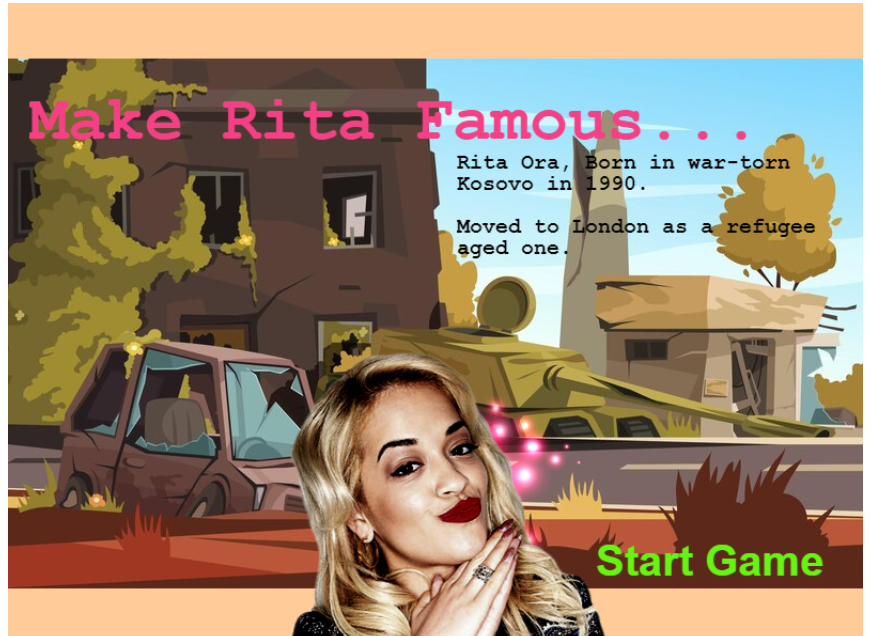
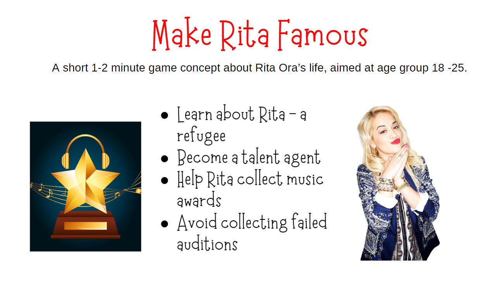

# Make Rita Famous
Aimed at ages 18-25, the 1-2 minute game offers a quick look into the early life of a celebrity refugee. The game allows the player to help the singer collect music awards then gain a VIP pass to chat with Rita. 

## Link to deployed page: 

https://vickysug.github.io/make-rita-famous/ (Note the chat scene is specific to Rosebud AI and will not work in the deployed Github link)

 ## Roesbud Link
 
 https://play.rosebud.ai/games/ba399420-11a0-4410-9728-3f3beee7e01d

## End mission:
Help Rita become famous by collecting music awards. After you have collectd them you can help her display them on a red carpet.

## Link to my storyborad on Canva: 

This is in a presentaion style:

https://www.canva.com/design/DAGHL3PF374/St0ZDztcuNN180yY15OiPg/edit?utm_content=DAGHL3PF374&utm_campaign=designshare&utm_medium=link2&utm_source=sharebutton

## Project Brief

This project was my second brief with my internship at BIZGEES. The brief:

* Select a celebrity who was a refugee.

* Compile the information and background.

* Create a short 30 second - 2 minute game aimed at age group 18 -25.

* The game is to allow the player to learn about the refugee.

* Use AI to aid the creation.

I chose the singer Rita Ora.

## Technologies used

For the project the aim was to use AI, mainly Rosebud AI (https://play.rosebud.ai/home)

On the platform a developer can clone games created by other developers and change them for their own purpose. 

I have chosen 2 games and combined them: 

The Junnkman: https://play.rosebud.ai/games/dd33d65e-27c0-45e8-9744-1de22a9d79ea Evolved from: 2D Playground 
Created by: hdc_to_ocp.  And the original 2D Playground.

Although Rosebud can generate AI images, I created all mine in Photoshop. 
Rosebud also allows the AI chat to change code, however, this didn't work for me so I went into the code myself and changed it. 

My Rosebud game link: https://play.rosebud.ai/games/ba399420-11a0-4410-9728-3f3beee7e01d

